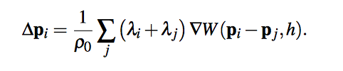

# Final Report

## Team Members

Yimin He

Yaqi Miao

## Abstract

In this project, we build a fluid simulation program using Position Based Fluids method. We firstly apply newton’s laws on particles, then correct to require incompressibility of fluid (requiring constant density of particles), then correct the constant density with an additional repulsive (tensile) term between particles (because the constant density term tends to produce clumps of particles). Finally, the using particles apparently leads to energy loss - the particles just settle down too quickly, so we use a vorticity calculation as a heuristic to add new energy into the system (base the amount of new force at that location on that location’s vorticity, which apparently makes sense for fluids), and in the end we attempt to include a viscosity term to introduce some clumpiness to the velocities, so that the fluid appears to move more like a whole and not like separate bouncing particles.

## Technical approach

### summary

We closely followed the simulation loop provided in the paper (Position Based Fluids, by Miles Macklin and Matthias Müller).

1. Apply external force and predict particle positions

The only force in the beginning of our simulation is gravity. So we apply gravity to each particle and get a predicted position for each of them.

2. Build spatial map and find neighbor particles

This is similar to what we did in project 4.

3. Calculate current density and how much position we can change to maintain current density

To calculate current density, we loop over each particle and find their neighbor, then repeatedly apply a kernel function which takes in this particle and its neighbor, and the cutoff distance we want to maintain, and sum the result.

Density calculation:

We used poly6 kernel fot density calculation:

Once we get density of each particle, we can apply a constraint on them:

Afterwards, our goal is to maintain this density. So we used the gradient of spikey kernel to calculate how much position we are allow to change in each simulation step.

The eqaution of the gradient of spiky kernel:

To calculate Lambda and delta_p:

Then we apply an artificial force to make it less clumpy, and add together:

4. Perform collision detection and boundary check

The paper did not specify this part. So we added several method to ensure this part. Specifically, the particles should maintain the cutoff distance when they get closer and they should not run out of the water tank.

5. Apply vorticity and XSPH viscosity, then update position.

### Problems encountered

1. Integrating GUI from previous projects: We kind of wanted to have a nice GUI like we did in the previous projects, but there were convoluted relationship between imported head files and unfamiliar libraries, so we decided to put it later if we have time.

2. Particles collisions: Initially we thought about simulating the dynamics of fluid by using particles as solid sphere and calculate the enternal and external forces. Later we realize that this method is not very good at efficiency and hard when debugging and real-time simulation. Seeing that, we chose to another way which is position based dynamics fluid simulation, with the help of the paper of Miles Macklin and Matthias Müller.

3. Computation precisions: Since we are dealing with a lot of gradients, a little error could result in terrible rendering accidents, such as particles gradually rise up and enventually flies a way in a whirl, massive particles disappeared because of a single computation overflow and particle positions becoming nan, and the fluid gradually slide to one side of the box.

4. Empirical terms: Some parameters, such as k, n, and $\Delta q$, needs to be manually tweaked. Some values doesn't seems to bring much difference if changed. Some values works better than the result we calculated on the paper.

### Lessons learned

1. Position based dynamics is a great framework for simulating incompressible flow. It's quite efficient while looking realistic.

2. There are lots of parameters and empirical values used in this program. It's best to use global variables and avoid magic numbers as that way will be easier for tuning. Theoretically perfect value doesn't always works better than other values - it takes time to experiment with different settings to find the best setup.

## Results
	
Your final images, animations, video of your system (whichever is relevant). You can include results that you think show off what you built but that you did not have time to go over on presentation day.

1. Final images:

2. Final video:

## References

1. (Largely inspired by) Evan Wallace’s WebGL Water Simulation project, https://www.chromeexperiments.com/experiment/webgl-water-simulation

2. Position Based Fluids, http://mmacklin.com/pbf_sig_preprint.pdf

3. Fast Water Simulation for Games Using Height Fields, http://matthias-mueller-fischer.ch/talks/GDC2008.pdf

4. Fluid Simulation for Dummies, https://mikeash.com/pyblog/fluid-simulation-for-dummies.html

5. Simulation and Visualization of a 3D Fluid, https://www.mikeash.com/thesis/thesis-en.pdf

6. Fluid Simulation for Video Games, https://software.intel.com/en-us/articles/fluid-simulation-for-video-games-part-1/

7. Real-Time Fluid Dynamics for Games, http://www.dgp.toronto.edu/people/stam/reality/Research/pdf/GDC03.pdf

8. Mesh Deformation, http://catlikecoding.com/unity/tutorials/mesh-deformation/

9. Coupling 3D Eulerian, Heightfield and Particle Methods for Interactive Simulation of Large Scale Liquid Phenomena, http://matthias-mueller-fischer.ch/publications/hybridsim_preprinted.pdf

10. GPU Accelerated Computing with C and C++, https://developer.nvidia.com/how-to-cuda-c-cpp

## Contributions from each team member:
Yimin He: Implemented fluid simulation logic, rendering method and main setup. 

Yaqi Miao: An alternative UI with camera view (not used), implemented Particle initialization, spatial hashing, finding neighbors, debugging and tuning the rendering parameters; milestone report, video, and slides.
