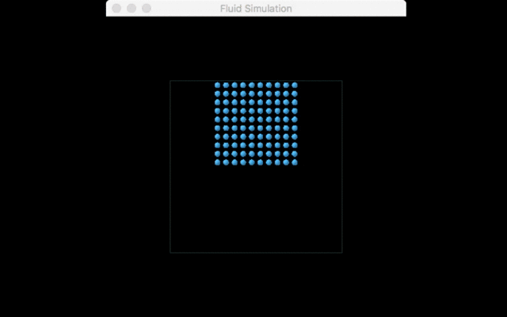

# Milestone Status Report: Position Based Fluid Simulation

## Summary
We decided to do the position based simulation of the fluid motion first. We implemented a basic UI that can be controlled with:

Key | Description
--- | ---
ESC, Q | Close window
up, down, left, right | Rotate view
Space | Run simulation for 1 step

Now we can run a simple simulation of fluid with the effect of gravity.

## What we have accomplished
We implemented the simulation of fluid dynamics with particles. Within our simulation loop, we have done:
1. Update the new falling position, assign position to last_position and store the new position after delta_t time elapsed.
2. Test neighboring particles with hash and map to see if particles fall onto each other and correct their positions if this happens.
3. Collision with the bounding box (water tank). We don't allow the particles, of course, fall out of the bounding box. 

## What need to be fixed
1. (Most priority) In step 2 where we test if neighboring particles fall onto each other, the plan after that was to recalculate the force exerted on each particle and update their velocity with regard to this new acceleration. This still doesn't work yet.
2. (Most priority) In collision of particles with other static object such as plane, now what we did is just to stop it before it collide. What really needs to be done is to calculate the force on the particle when it collide with other object. We expect to see the particles bounce back and forward in the water tank.
3. (Less priority) Although we are able to roate the view through direction keys, rotate on the y direction still need to be fixed.
4. (Less priority) Consider moving current progress to another code base adapted from clothsim.

## What may need to be added
1. Adding vorticity and viscosity to our simulation. This may require adding new constraints to the particles.
2. Collision with other objects, such as sphere or other irregular meshes.
3. More UI features.
4. Running on GPU.
5. Integration with raytracer.

## Reference
1. James Jia, Michelle Nguyen, Angela Hsueh _Final Project: Fluid Simulation_ http://jamesjia.com/cs184-fluidsim

## Updated work plan
This week (4/25~4/28) must fix all the most priority bugs.

Next week (4/29-5/5) try to do as much as we can in the items that needs to be added.

## Video link
https://drive.google.com/file/d/0B1Qacbi87D4WMi1PN1oxQnJleDA/view?usp=sharing

## Slides
https://docs.google.com/presentation/d/1L3AqJCubJB-bNyg07EO5UAhymmV_3D9ouPPONYSxG0A/edit?usp=sharing

