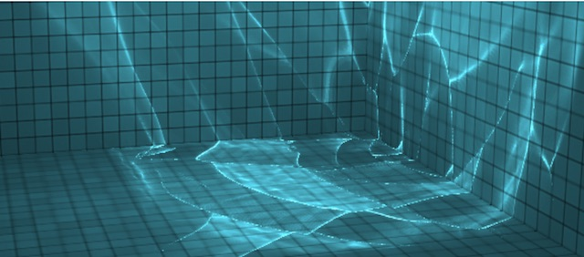
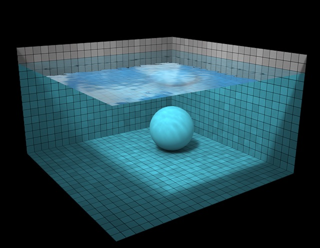
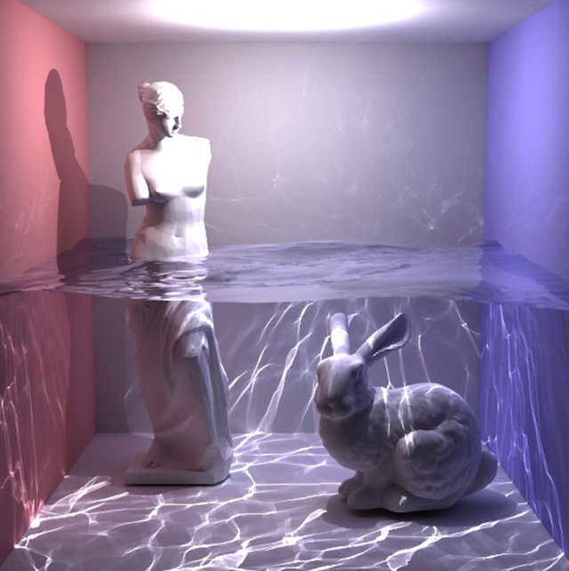

# Proposal: Fluid Simulation

## Summary
3D Water Simulation, filling Cornell Box half with water and rendering with Raytraced reflection and refraction, caustics. Water will be simulated with either Particle Method or Height fields Method. Maybe also implement interactive objects (spheres/cubes) in the water and air bubbles in the water or gas-liquid transition.

## Team Members

Yaqi Miao

Yimin He

## Problem Description

We going to simulate water in the Cornell Box. Once it is done, it can be applied in rendering any scenes with fluid. The main challenges we are facing now are 1) how to model the motion of fluid, 2) realistic lighting effects, such as caustics.

## Goals and Deliverables

### GOALS:
1. What we are trying to accomplish: A realistic 3D water simulation program based on the Ray-tracer project.

2. What results we are going for:

   i. Caustics Effect : 

   ii. Water Simulation : 

   iii. Integrated with Ray-Tracer : 

3. Performance: Since it is a project based on real ray-tracing, we don’t expect it will be able to render the animation instantly. The goal is to render a single frame in .5 hr, or, a short demo animation in 2-3s with 60fps in acceptable amount of time (~24 hrs).

4. With our analysis, we will answer how to model the water dynamics in computation and the lighting effects that we considers when rendering a scene with water.

5. Why we think we can accomplish those goals:
   i. We have plenty of resources
   ii. when there is a will there is a way...XD...

### DELIVERABLES:
1. what we __plan__ to deliver:
Baseline plan is to finish the fluid simulation program. In other words, at least show some water in the box. Maybe not interactive but should work well with still objects.

2. what we __hope__ to deliver: 
   * Animation - to show the motion of fluids, how wave travels on the surface of water (ripple), and the interaction of water with air (vapor and boiling water).
   * Interactive program - user can toggle the position and density of objects and see objects interact with water.

## Schedule
__Week 1 (April 7th - April 9th):__
- Brainstorm project ideas.
- Submit proposal.
- Search relevant resources.
- Study resources and experiment with different fluid simulation models.
- Learn to use CUDA.

__Week 2 (April 10th - April 17th):__
- Implement water simulation: the goal is to render a scene with only still water correctly, especially the refraction and reflection at the surface of water and air.

__Week 3 (April 18th - April 25th):__
- Implement caustics and a working model of the dynamics of water.

__Week 4 (April 26th - May 3rd):__
- Optimize the model and maybe implement interactive features or consider more complicated scenes.

## Resources

1. (Largely inspired by) Evan Wallace’s WebGL Water Simulation project, https://www.chromeexperiments.com/experiment/webgl-water-simulation

2. Position Based Fluid, http://mmacklin.com/pbf_sig_preprint.pdf

3. Fast Water Simulation for Games Using Height Fields, http://matthias-mueller-fischer.ch/talks/GDC2008.pdf

4. Fluid Simulation for Dummies, https://mikeash.com/pyblog/fluid-simulation-for-dummies.html

5. Simulation and Visualization of a 3D Fluid, https://www.mikeash.com/thesis/thesis-en.pdf

6. Fluid Simulation for Video Games, https://software.intel.com/en-us/articles/fluid-simulation-for-video-games-part-1/

7. Real-Time Fluid Dynamics for Games, http://www.dgp.toronto.edu/people/stam/reality/Research/pdf/GDC03.pdf

8. Mesh Deformation, http://catlikecoding.com/unity/tutorials/mesh-deformation/

9. Coupling 3D Eulerian, Heightfield and Particle Methods for Interactive Simulation of Large Scale Liquid Phenomena, http://matthias-mueller-fischer.ch/publications/hybridsim_preprinted.pdf

10. GPU Accelerated Computing with C and C++, https://developer.nvidia.com/how-to-cuda-c-cpp

